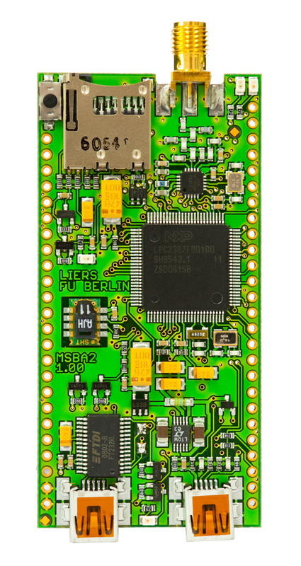
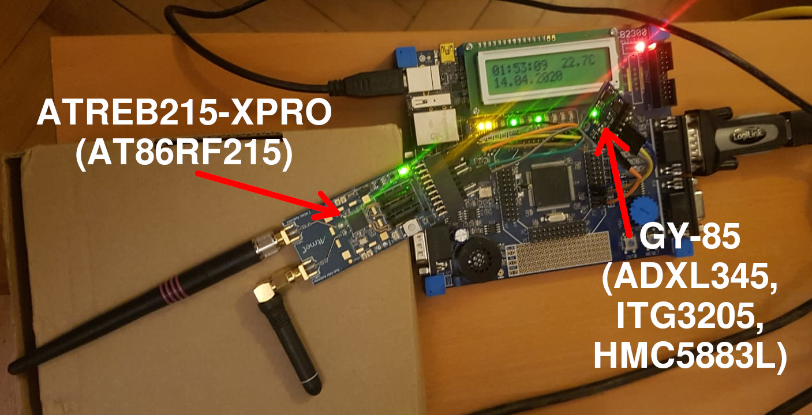

# Das Betriebssystem RIOT

Bei [RIOT](https://github.com/RIOT-OS/RIOT) handelt es sich um ein freies Betriebssystem für Microcontroller.
Ziel ist es, durch eine dünne Hardwareabstraktionsschicht Code zu schreiben, der auf Hardwareplatformen
verschiedener Hersteller lauffähig ist.
Dadurch ist eine leichte Wiederverwendbarkeit von Softwaremodulen und Treibern gegeben, sofern für eine
Platform die nötigen low-level Treiber implementiert sind.

Seinen Ursprung hat RIOT an der Freien Universität Berlin, heute wird es an einer Vielzahl von Hochschulen
und Forschungseinrichtungen eingesetzt.
Ein besonderes Merkmal ist ein vollständiger IPv6 Stack mit 6LoWPAN Erweiterung, der das effiziente
versenden von IP Paketen in Sensornetzen ermöglicht.

## RIOT und LPC23xx

Seinen Urpsrung hat RIOT als *FireKernel* im *FeuerWhere* Projekt (2008) zur Indoor-Lokalisierung von
Einsatzkräften. Als Hardwareplatform entstand hierbei das *ScatterWeb MSB-A2 Board* als leistungsfähigerer
Nachfolger zum *MSB-430*.
Während letzteres auf den 16-bit MSP430 von Ti setzte, kam beim MSB-A2 ein 32-bit ARM7TDMI-S in Form des
LPC2387 von NXP zum Einsatz.
Als Funkchip setzte man weiterhin auf den per SPI angebundenen CC1100, der bereits auf dem *MSB-430*
zu finden war.



Nun muss man sagen, dass seinerzeit der Fokus wohl noch nicht darauf lag, ein universelles Betriebssystem
zu schaffen. Das änderte sich zwar schon bald, als aus *FireKernel* *µkleos* wurde, doch lag der Fokus
weiterhin mehr auf Sensornetzen als in einer möglichst universell einsetzbaren Hardwareabstraktion - was
man für die Ansteuerung des CC1100 Funkchips brauchte war ja bereits vorhanden.

Das änderte sich schließlich mit der Umbenennung in *RIOT* und dem Ziel, auch ein für externe Entwickler
nützliches System zur Verfügung zu stellen.
Doch lag der Fokus der Entwicklung nun auf den moderneren Cortex-M Mikroprozessoren, der `lpc2387` Port
fand nur noch wenig Beachtung und es gab bereits Diskussionen, ihn ganz zu entfernen.

Hier setzte nun mein Projekt an: Mein Ziel war es, den `lpc2387` Port zu einer vollwertigen RIOT-Platform
wiederherzustellen, so dass sie auch in Zukunft noch für verschiedene Projekte genutzt werden kann.

Dies umfasste natürlich auch die Unterstützung für den `lpc2388` wie er auf dem MCB2388 board zu finden ist.
(Wobei dieser sich von seinem Bruder nur durch den zusätzlichen USB-Host Controller und einer anderen
Prozessor-ID unterscheidet.)

## Eine Bestandsaufnahme

Der `lpc2387` Port befand sich zu Begin des Projekts in einem Zustand, in dem Funktionalität oft nur so
weit implemtiert war, wie sie für den Anwendungsfall des `msba-a2` Boards nötig war.
Entsprechend waren Treiber oft hard-gecoded mit festen Werten für Pins und Datenraten.

 - UART: Nur ein UART mit fixer Baudrate
 - PLL config erwartet 16 MHz Quart (`mcb2388` hat 12 MHz Quartz)
 - SPI: Nur ein SPI mit fixer Frequenz
 - I2C: nicht implementiert
 - ADC: nicht implementiert
 - DAC: nicht implementiert
 - Power Management / Backup RAM: nicht implementiert
 - diverse kleinere Bugs

Im Zuge des Projektes ist es mir gelungen, diese Defizite zu beheben.

## Board Support für MCB2388

Die von RIOT unterstützen Boards sind im `boards/` Verzeichnis zu finden.
Der erste Schritt bestand entsprechend darin, ein neues Verzeichniss für das `mcb2388` anzulegen.

In `boards/mcb2388/include/periph_conf.h` wird die Peripherie der CPU konfiguriert.
Hier wird z.B. `UART0` auf die `COM0` Schnittstelle konfiguriert, dieser dient als Standardein- und Ausgabe.
Es findet auch Konfiguration von SPI und I2C Schnittstellen statt.

Die Konfiguration ist rein deklarativ.
Sie wird von den entsprechenden Treibern in `cpu/lpc2387/periph` gelesen und umgesetzt.

In `boards/mcb2388/include/board.h` findet die deklarative Konfiguration von Hardware statt, die and die MCU
angeschlossen ist.
Hier werden etwa Macros zum setzen der LEDs definiert, aber auch Parameter für Treiber für auf dem Board
vorhandene Hardware finden hier ihren Platz.
So erfolgt hier z.B. die Konfiguration für das HD44780-Display, für das RIOT bereits über einen
[Treiber](https://doc.riot-os.org/group__drivers__hd44780.html) verfügt:

```{.C include=../../../include/board.h startLine=99 endLine=111}
```

In den `Makefile`s des Boards wird außerdem festgelegt, welche MCU-Features auf dem Board nach außen
geführt sind und auf welche weise es zu flashen ist.

Da sich das Board unter Linux mit OpenOCD nicht zuverlässig mit dem Keil ULINK-ME flashen ließ, habe ich
hier auf den UART Bootloader und das Tool `lpc2k_pgm` zurückgegriffen.
Der Flashvorgang erfolgt über den COM0 Port und erfodert eine Serielle Schnittstelle am Hostcomputer.

## Übersicht über meine Pull-Requests in RIOT

Inzwischen wurden sämtliche meiner Änderungsvorschläge zur Verbesserung der `lpc23xx` Unterstützung
in RIOT gemerged. Das in den kommenden Tagen erscheinende RIOT 2020.04 Release wird mit einer vollwertigen
Unterstützung für das `mcb2388` mit sämtlicher Peripherie erscheinen.

Die Änderungen im Einzelnen:

 - [`#12229: cpu/lpc2387: clean up the platform`](https://github.com/RIOT-OS/RIOT/pull/12229)
 - [`#12580: cpu/lpc2387: enable RTC on rtc_init()`](https://github.com/RIOT-OS/RIOT/pull/12580)
 - [`#12581: cpu/lpc2387: allow for more flexible clock selection`](https://github.com/RIOT-OS/RIOT/pull/12581)
 - [`#12637: cpu/lpc2387: update the UART driver`](https://github.com/RIOT-OS/RIOT/pull/12637)
 - [`#12669: boards: add mcb2388`](https://github.com/RIOT-OS/RIOT/pull/12669)
 - [`#12747: cpu/lpc2387: implement periph/pm`](https://github.com/RIOT-OS/RIOT/pull/12747)
 - [`#12748: cpu/lpc2387: add support for backup RAM`](https://github.com/RIOT-OS/RIOT/pull/12748)
 - [`#12809: cpu/lpc2387: implement periph/dac`](https://github.com/RIOT-OS/RIOT/pull/12809)
 - [`#12830: cpu/lpc2387: clean up lpc2387.ld, fixes tests/cpp_ctors`](https://github.com/RIOT-OS/RIOT/pull/12830)
 - [`#12868: lpc2k_pgm: fix build warnings, add lpc2388`](https://github.com/RIOT-OS/RIOT/pull/12868)
 - [`#12871: cpu/lpc2387: rtc: remove use of localtime() `](https://github.com/RIOT-OS/RIOT/pull/12871)
 - [`#12899: cpu/lpc2387: align lpc2387.ld with cortexm_base.ld, provide thread_isr_stack_*() - enables MicroPython`](https://github.com/RIOT-OS/RIOT/pull/12899)
 - [`#12901: cpu/lpc2387: use the same default stack sizes as cortexm_common`](https://github.com/RIOT-OS/RIOT/pull/12901)
 - [`#12911: cpu/lpc2387: implement periph/adc`](https://github.com/RIOT-OS/RIOT/pull/12911)
 - [`#12928: sys/newlib: enable multiple heaps in _sbrk_r()`](https://github.com/RIOT-OS/RIOT/pull/12928)
 - [`#13037: cpu/lpc2387: implement periph/i2c`](https://github.com/RIOT-OS/RIOT/pull/13037)
 - [`#13246: cpu/lpc2387: make SPI configurable`](https://github.com/RIOT-OS/RIOT/pull/13246)
 - [`#13857: cpu/lpc2387: gpio: Fix interrupts on PORT2`](https://github.com/RIOT-OS/RIOT/pull/13857)
 - [`#13817: cpu/lpc2387: fix check for max number of timers`](https://github.com/RIOT-OS/RIOT/pull/13817)
 - [`#13317: tests/event_threads: remove arch_arm7 from blacklist`](https://github.com/RIOT-OS/RIOT/pull/13317)

Mein besonderer Dank gillt hierbei Marian Buschsieweke, der mir stets mit Kommentaren und Anmerkungen zur
Seite stand und sicherstellte, dass die Änderungen auch auf dem `msba2` weiterhin funktionieren.

## Ausblick

Der Prozessor verfügt weiterhin über Peripherie, für die es in RIOT noch keinen Treiber gibt:

 - USB Controller
 - Ethernet Controller
 - DMA Controller

Insbesondere der USB Controller wäre ein interessantes Projekt, da RIOT bereits über einen USB Stack
verfügt. Die Implementierung der Low-Level Schnittstelle würde also ermöglichen, auf dem `mcb2388` Board
mit nur einem Mini-USB Kabel eine Serielle Schnittstelle (CDC-ACM) oder Netzwerkschnittstelle (ECM) am
Host-PC bereitzustellen.
Ähnlich interessant wäre auch der Ethernetcontroller, der Netzwerkstack existiert ja bereits.

# Demo-Projekt: Uhr mit Temperatursensor und Funkanbindung



Ziel des Demo-Projekts soll es sein, alle Komponenten im Zusammenspiel zu zeigen.
Insbesondere I2C und SPI, aber auch der UART sollen demonstriert werden.

### UART

Über den UART läuft die normale RIOT Shell. `help` liefert eine Übersicht über alle Befehle.

### I2C

Am I2C Bus hängt ein GY-85 Modul, auf dem ein Accelerometer (`adxl345`), ein Gyroskop inclusive
Temperatursensor (`itg3205`) sowie ein Magnetometer (`hmc5883l`) verbaut sind.
Auf meinem Exemplar scheint das Magnetometer defekt zu sein und antwortet nicht auf seine Addresse,
die anderen Sensoren arbeiten jedoch tadellos.
RIOT verfügt bereits über Treiber für diese Bausteine, wodurch sie sich über das allgemeine Sensor-Interface
SAUL auslesen lassen.


Für die Demo verwende ich lediglich den Temperatursensor - sie soll ja nur zeigen, dass I2C funktioniert.

### SPI

An den SPI-Bus habe ich ein ATREB215-XPRO Modul mit dem Dual-Band 802.15.4g Transceiver `at86rf215` angeschlossen.
Für diesen Chip hatte ich bereits einen RIOT-Treiber geschrieben (zu finden in `drivers/at86rf215`).

Ich habe außerdem eine `esp32`-WiFi MCU mit angeschlossenem `at86rf233` (802.15.4, 2.4GHz) Modul als Border Router laufen.


Auf diesem läuft `examples/gnrc_border_router` mit `UPLINK=wifi` und einer leicht angepassten Konfiguration
um das `at86rf233` Modul zu verwenden.
Er verbindet sich mit meinem WLAN und erhält von der Fritz!Box ein IPv6 Präfix, dass für das 6LoWPAN Netz
verwendet wird. Er fungiert damit als Gateway zwischen 6LoWPAN und dem Normalen IPv6-Internet.

Entsprechend kann der `mcb2388` so auch Hosts im Internet erreichen.


Da der `at86rf233` nur auf 2.4 GHz funkt, erhält das sub-GHz Interface des `at86rf215` keine globale
Addresse. RIOT wählt automatisch das richtige Uplink-Interface aus.

### ADC, DAC & RTC

Da sie vermutlich über keines dieser Module verfügen und ich den Aufbau Quarantäne bedingt aktuell nicht
vorführen kann, soll das Board natürlich dennoch etwas interessantes machen, wenn sie den Code flashen.

Da das Board über einen DAC mit angeschlossenem Lautsprecher verfügt, bietet es sich natürlich an,
darüber Sound abzuspielen.

Zu diesem Zweck konfiguriere ich einen Hardware Timer so, dass er 8000 mal in der Sekunde einen Interrupt
auslöst, um so eine Sample-Rate von 8kHz zu erreichen.
Im Interrupt wird der aktuelle Wert aus dem Abspiel-Puffer in das DAC Register geschrieben und der Buffer
Pointer incrementiert.
Ist der aktuelle Puffer aufgebraucht wird auf den nächste Puffer gewechselt, so dieser verfügbar ist.
Es wird außerdem ein Callback ausgelöst, wodurch der Anwendung signalisiert werden kann, dass nun der alte
Puffer wieder mit neuen Daten befüllt werden kann.

So werden die Soundeffekte beim Drücken der Taste zur Laufzeit generiert.
Die Begrüßung am Anfang, ein Ausschnitt der *Synthesized Speech* Demo der Bell Labs von 1961, liegt jedoch
einfach so als unkomprimierter PCM Datenstrom im Flash und wird direkt von dort abgespielt.
Das hat allerdings seinen Preis: Die wenigen Sekunden unkomprimiertes 8-bit / 8 kHz Audio belegen bereits
97kiB des Flash-Speichers.

Die Implementierung dazu findet sich in `cpu/lpc2387/periph/dac.c` bzw der Anwendungsteil in`sound.c`.

```{.C include=../../../../../cpu/lpc2387/periph/dac.c startLine=68 endLine=112}
```

Das Potentiometer am ADC wird benutzt, um die Uhrzeit einzustellen. Der `INT0` Button dient dabei als
Bestätigungstaste.

Am Ende wird die Uhrzeit der RTC auf dem Display angezeigt. Wenn ein `itg320x` Temperatursensor
angeschlossen ist, zusätzlich auch die Temperatur.

## Flashen des Demo-Projekts auf dem Board
